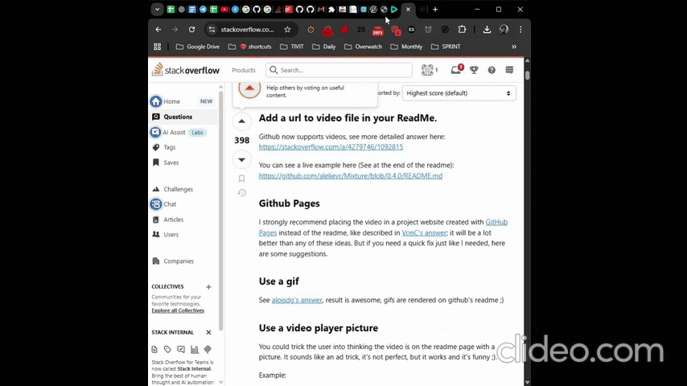

# endoh-zephyr-mf

Micro-frontend TO-DO app for Zephyr technical task. The TO-DO items are saved in local storage.

## Preview

https://paulo-endoh-v04v6xgtul-485-mf-host-endoh-zephyr-m-c6000e7ed-ze.zephyrcloud.app/

## Run the project

1. Install dependencies:
   `pnpm run i`

2. Start the applications
   `pnpm run start`

3. Enter the following URLs in your browser:
   - Host application: `http://localhost:8080`
   - Remote application: `http://localhost:8012`

## Technologies used

- React, TypeScript, pnpm workspaces, rspack, Module Federation and Mantine (UI library).

## Project structure

- `apps/mf-host` - Host application. Contains AppShell, which loads the remote TO-DO app.
- `apps/mf-remote` - Remote application. Contains TO-DO app page content.
- `apps/shared` - Shared files between host and remote applications (e.g. types, UI components).
